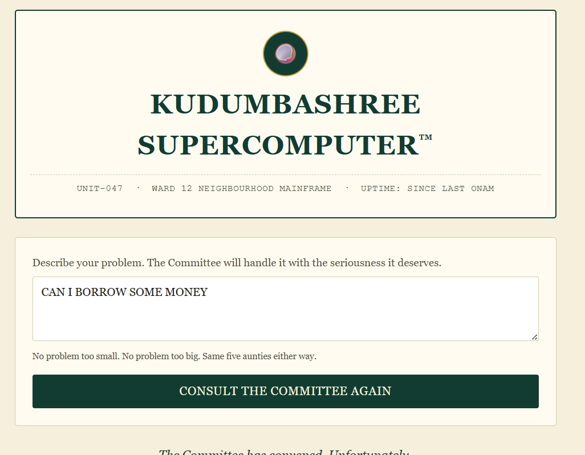
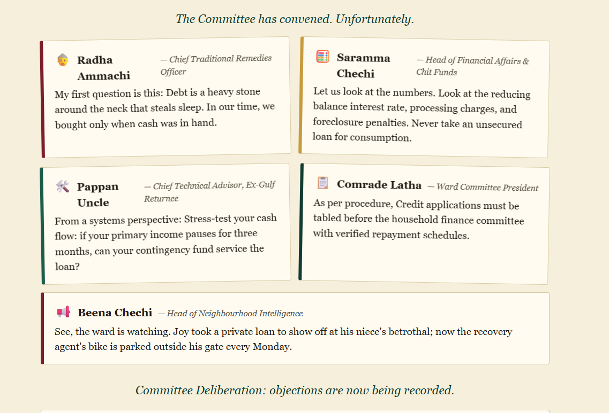
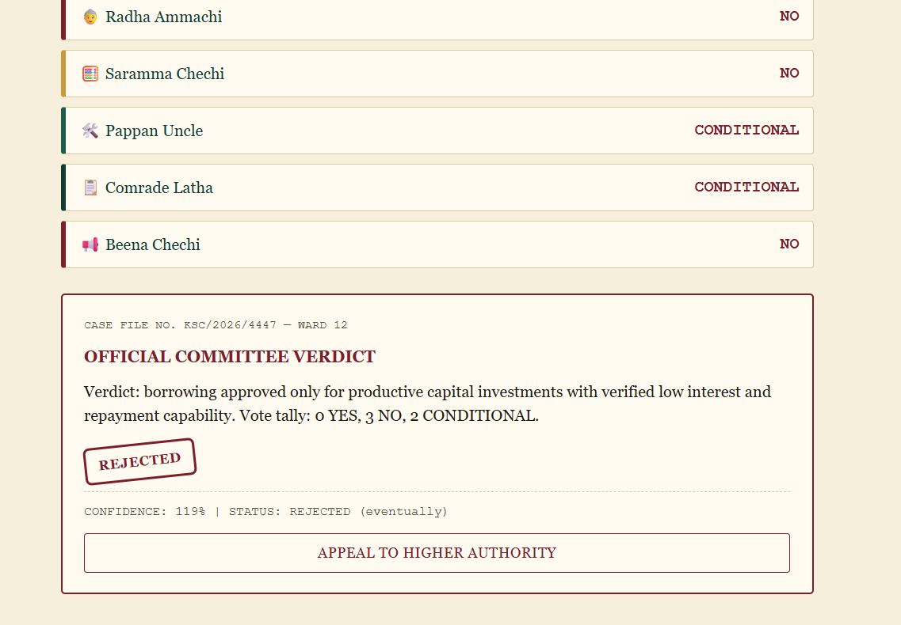
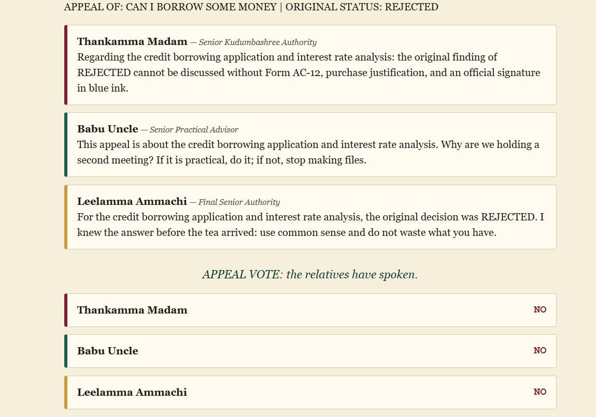
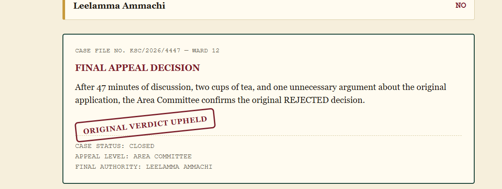

KUDUMBASHREE SUPERCOMPUTER™ 🎯
Basic Details
Team Name:

Bamboo boys

Team Members
Team Lead: Fayaz — MES College of Engineering and Technology, Kunnukara
Member 2: Jazim — MES College of Engineering and Technology, Kunnukara
Project Description

KUDUMBASHREE SUPERCOMPUTER™ is a humorous web-based advisory system that replaces a normal AI assistant with a neighbourhood committee of opinionated Kerala aunties and uncles. Every user problem is discussed by the committee, voted upon, and converted into an official verdict, with an option to appeal to a higher authority.

The Problem (that doesn't exist)

Modern AI assistants are too neutral and peaceful. People are making important decisions—such as borrowing money, buying phones, choosing gadgets, or dealing with everyday problems—without being questioned, judged, warned, or reminded about what the neighbourhood thinks.

The Solution (that nobody asked for)

We created KUDUMBASHREE SUPERCOMPUTER™, a completely unnecessary but highly serious neighbourhood decision-making system.

Every problem goes through a subject detection system and is then presented to five committee members. Each member gives their own opinion based on their personality and area of expertise. The committee then conducts a democratic vote and produces an official APPROVED, REJECTED, or CONDITIONAL verdict.

If the user disagrees with the decision, they can Appeal to Higher Authority, where three senior committee members review the case and provide the final decision.

Technical Details
Technologies/Components Used
For Software:
Languages: HTML5, CSS3, JavaScript (ES6+)
Frameworks: None
Libraries: None
Tools: Visual Studio Code, Git, Node.js
Architecture: Vanilla client-side web application
External APIs: None
For Hardware:
Not applicable
This is a pure software project
Implementation
For Software:

The application uses a lightweight client-side architecture. The user's problem is first analysed to identify its subject. The system then generates committee responses from different personalities, calculates their votes, displays the official verdict, and provides an appeal mechanism when required.

The main committee members are:

Radha Ammachi — Chief Traditional Remedies Officer
Saramma Chechi — Head of Financial Affairs & Chit Funds
Pappan Uncle — Chief Technical Advisor, Ex-Gulf Returnee
Comrade Latha — Ward Committee President
Beena Chechi — Head of Neighbourhood Intelligence

The Area Committee consists of:

Thankamma Madam — Senior Kudumbashree Authority
Babu Uncle — Senior Practical Advisor
Leelamma Ammachi — Final Senior Authority
Installation

Clone the repository:

git clone https://github.com/fayazrasheed3-crypto/useless_project_temp.KUDUMBASHREE-SUPERCOMPUTER.git

Navigate to the project directory:

cd useless_project_temp.KUDUMBASHREE-SUPERCOMPUTER

No additional package installation is required.

Run
Option 1: Open directly

Open index.html in your browser.

On Windows:

start index.html
Option 2: Run using Python
python -m http.server 8000

Then open:

http://localhost:8000
Option 3: Run using Node.js
npx serve .
Project Documentation
# Screenshots

## 1. Consultation Console

*The main KUDUMBASHREE SUPERCOMPUTER™ interface where the user enters a problem and asks the neighbourhood committee for a decision.*

---

## 2. Committee Deliberation

*The five committee members discuss the submitted problem from their own perspectives, ranging from traditional advice and financial concerns to technical and neighbourhood opinions.*

---

## 3. Committee Voting and Official Verdict

*The committee members cast their votes as YES, NO, or CONDITIONAL, after which the system generates the official committee verdict.*

---

## 4. Appeal to Higher Authority

*After the original verdict is rejected, the user can appeal the decision to the Area Committee for another round of discussion and voting.*

---

## 5. Final Appeal Decision

*The Area Committee announces the final decision. In this example, the original rejected verdict is upheld and the case is officially closed.*
Diagrams
Workflow

The workflow shows the complete process from submitting a problem to committee deliberation, voting, official verdict, and final appeal.

For Hardware
Schematic & Circuit

Not Applicable — this project is completely software-based.

Build Photos

Not Applicable — there are no physical hardware components.

Project Demo
Video

Demo Video: SCRN_RCRD.mp4

The demonstration shows the complete application workflow, including:

Entering a problem into the consultation console
Starting the committee consultation
Viewing opinions from all committee members
Recording committee votes
Generating the official verdict
Appealing a rejected decision
Reviewing the case through the Area Committee
Displaying the final appeal decision

If the video is uploaded to YouTube or Google Drive, replace the link below:

[Watch the Demo Video]((https://drive.google.com/file/d/1KLZMd0Z3N4eA43LSHX3Vl1sAD5Ey8iv7/view?usp=sharing))
Additional Demos

The project demonstrates different types of everyday decisions and produces different committee outcomes such as:

APPROVED
REJECTED
CONDITIONAL

The appeal system allows the user to escalate a decision when they are not satisfied with the original verdict.

Team Contributions
Fayaz: Designed and developed the core application architecture, implemented the subject detection system, structured the committee personality logic, managed the consultation state, and implemented the voting and verdict workflow.
Jazim: Designed and developed the UI/UX, implemented the Kerala neighbourhood committee-inspired visual design, responsive styling and animations, committee deliberation interface, voting display, and Area Committee appeal system
---
Made with ❤️ at TinkerHub Useless Projects 

